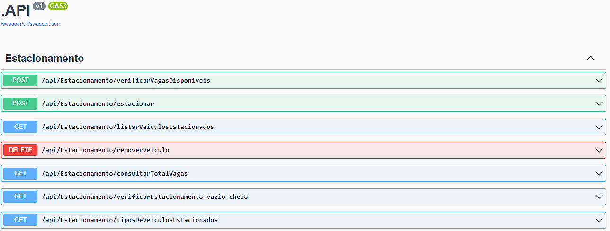

*** Olá avaliador, este projeto foi desenvolvido utilizado C# .NET usando Entity Framework Core para tentar sanar as espectativas requeridas como regra de negócios de um Estacionamento. ***
**
A demais, peço desculpas por quaisquer erros, falhas ou omições em algum trecho ou lógica implementada, estou literalmente com dengue, muito debilitado e fazendo o teste, caso não passe, não quero o peso na consciência de não ter feito meu melhor, mesmo nesta situação. Agradeço por avaliarem meu teste, se tudo ocorrer bem, nós vemos em breve.
**

***INDEX***
1 - Estruturação, Padrão de Arquitetura 
2 - Criação e Desenvolvimento
3 - Observações do Projeto

**********************************************************************************************************************************************

*** 1 - Estruturação, Padrão de Arquitetura ***
Este projeto foi executado seguindo o padrão de criação ***Factory Method***, padrão Arquiteturais  ***em Camadas (Layered Architecture Pattern )***,
alinhado a implementação de ***Multi-Tenant Database Pattern***.

*** 2 - Criação e Desenvolvimento ***
Este projeto é uma aplicação de estacionamento que permite verificar vagas disponíveis, estacionar veículos, listar veículos estacionados, remover veículos, consultar vagas restantes por tipo de veículo, verificar o total de vagas, verificar se o estacionamento está vazio ou cheio, e obter informações sobre tipos de veículos estacionados.

A estrutura do projeto segue uma arquitetura em camadas, com diferentes responsabilidades distribuídas em pastas específicas:

API.csproj
Define a configuração para executar a aplicação como uma API, incluindo configurações de lançamento e ambiente.

Controller
Contém o controlador EstacionamentoController.cs, responsável por receber as solicitações HTTP, processá-las e retornar as respostas adequadas.

Data
Contém a classe DataContext.cs, que define o contexto do banco de dados usando o Entity Framework Core.

Migrations
Contém os arquivos relacionados às migrações do banco de dados.

appSettings.json e appSettings.Development.json
Arquivos de configuração que incluem a string de conexão com o banco de dados e outras configurações específicas de desenvolvimento.

Program.cs
Define a classe principal do programa, responsável por criar o host da aplicação e aplicar as migrações do banco de dados no ambiente de desenvolvimento.

Startup.cs
Configura os serviços da aplicação, incluindo injeção de dependência, configuração do Entity Framework, configuração do Swagger para documentação da API e definição de middleware.

Application.csproj
Define as interfaces de serviço para operações relacionadas a vagas e veículos.

IService
Contém as interfaces IVagaService.cs e IVeiculoService.cs, que definem os contratos para serviços relacionados a vagas e veículos, respectivamente.

Method
Contém a classe EstacionamentoMethod.cs, que define métodos utilitários para cálculos e verificações relacionados ao estacionamento.

Service
Contém as implementações dos serviços definidos nas interfaces em Application.csproj.

Domain.csproj
Define as entidades do domínio e os enums relacionados a tipos de veículos e vagas.

Entities
Contém as classes de entidade Estacionamento.cs, Vaga.cs e Veiculo.cs, que representam os objetos do mundo real armazenados no banco de dados.

Enum
Define os enums TipoVaga.cs e TipoVeiculo.cs, que representam os tipos de vaga e veículo, respectivamente.

Validation
Contém a classe Validadores.cs, que define validações personalizadas para os campos das entidades.

Persistence.csproj
Define o contexto do banco de dados usado pelo Entity Framework Core.

TenantContexts
Contém a classe Context.cs, que define o contexto do banco de dados específico para a aplicação de estacionamento.

Essa arquitetura separa as preocupações da aplicação, tornando-a mais organizada, modular e fácil de dar manutenção. Cada componente tem sua responsabilidade bem definida, o que facilita o desenvolvimento, a depuração e a evolução do sistema.

*** 3 - Observações do Projeto ***
O projeto foi desenvolvido usando PostgreSQL, você ao baixar o projeto pode executar tanto em sua maquina, caso tenha o PostgreSQL instalado ou utilizado o Railway,
que é onde está hospedado seu Banco de Dados.

Caso queira rodar em sua maquina, as variaveis são essas:
PGPASSWORD=fXCBFehLgChuURXNFkphlAlZwDhZhkal psql -h viaduct.proxy.rlwy.net -U postgres -p 39146 -d railway

PGPASSWORD: fXCBFehLgChuURXNFkphlAlZwDhZhkal
PGHOST: viaduct.proxy.rlwy.net
PGUSER: postgres
PGPORT: 39146
PGDATABASE: railway

Com estes dados você consegue acesso e conexão ao DB.

Este banco de dados pode ser acompanhado de forma física pelo Railway ou outra ferramenta de software como DBeaver ou outra a sua escolha.

Neste banco, já está criado o Estacionamento e 10 vagas, 4 para Motocicletas, 4 para Carros e 2 para Vans.
As vagas 1, 2, 3 e 4 são para Moto;
5, 6, 7, 8 para Carro;
9 e 10 Van.

Os veículos são compostos por 3 tipos:
1 - Moto;
2 - Carro;
3 - Van.

Ao realizar um cadastro de Estacionamento, não é necessario preencher o IdVeiculo e o campo HoraEntrada!

1º Após o git clone, você irá rodar o projeto normalmente utilizando:

2º Após isso, irá abrir uma segunda tela que será o Swagger, nela você pode testar a vontade.
